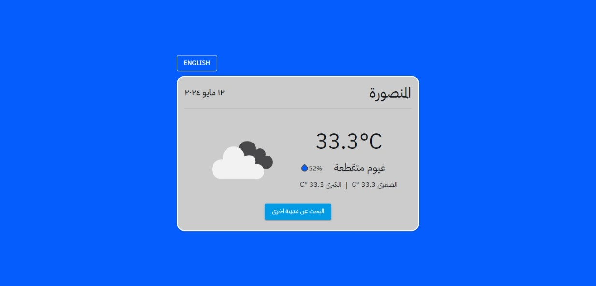

# Weather App

## Description

The Weather App is a simple application that allows users to get real-time weather information for a specific location. It provides users with current weather conditions, temperature, humidity and more.

## Features

- Get real-time weather information for any location
- Display current weather conditions, temperature, humidity, and more
- User-friendly interface with intuitive design
- Responsive layout for seamless experience on different devices
- Support for displaying content in Arabic and English
- Better error handling

## Installation

1. Clone the repository: `git clone https://github.com/your-username/weather-app.git`
2. Navigate to the project directory: `cd weather-app`
3. Install the dependencies: `npm install`

## Usage

1. Run the application: `npm start`
2. Open your web browser and go to `http://localhost:3000`
3. Enter the desired location in the search bar and click "Search"
4. The weather information for the specified location will be displayed

## Technologies Used

- HTML
- CSS
- JavaScript
- React
- OpenWeatherMap API

## Contributing

Contributions are welcome! If you find any issues or have suggestions for improvements, please open an issue or submit a pull request.

## License

This project is licensed under the [MIT License](LICENSE).

## Contact

For any questions or inquiries, please contact [abdo.soliman156@gmail.com](mailto:abdo.soliman156@gmail.com).
